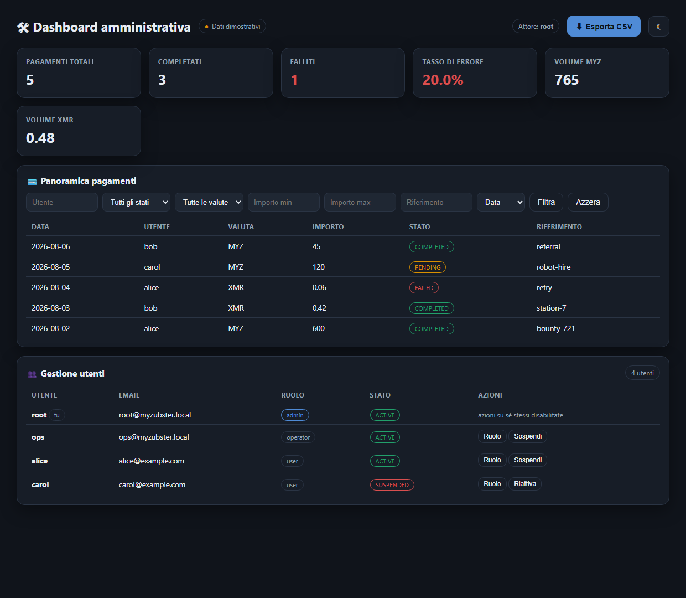

# Administrative dashboard

Payments overview, advanced filtering, data export and user management for operators.

Page at **`/admin`**, API under **`/api/admin`**.



## API

| Method | Path | Purpose |
| --- | --- | --- |
| `GET` | `/api/admin/overview` | Counts by state, volume and settled per currency, daily series, failure rate |
| `GET` | `/api/admin/payments` | Advanced filter + sort + pagination |
| `GET` | `/api/admin/payments/export` | CSV of the filtered set |
| `GET` | `/api/admin/users` | List and filter users |
| `POST` | `/api/admin/users/:userId/role` | Change a role |
| `POST` | `/api/admin/users/:userId/state` | Suspend or reactivate |
| `GET` | `/api/admin/audit` | Who did what, newest first |

Filters on `/payments`: `userId`, `status`, `currency`, `from`, `to`, `minAmount`, `maxAmount`, `reference` (substring), `sort` (`createdAt` / `amount` / `status`), `order`, `limit`, `offset`. They compose with AND.

## Access control

Every method takes the acting admin **explicitly**; the service never reads an ambient session. Passing the actor in means an action can always be attributed in the audit log, and the check cannot be skipped by calling the service from somewhere new.

Four rejections, all `403`: no actor, unknown actor, non-admin, and suspended admin. `ForbiddenError` carries `status = 403` so the route layer does not have to guess.

The route currently reads the actor from an `x-actor-id` header. **That is the seam where the gateway's real session middleware belongs** — replacing it is a one-line change in `routes/admin.js`, and nothing downstream needs to change.

## The last-admin invariant

The system always keeps at least one active admin, and this falls out of two rules:

- an admin cannot demote themselves
- an admin cannot suspend themselves

Since only an *active admin* may act at all, demoting or suspending **someone else** always leaves the actor standing. The only path to zero admins is acting on yourself, which is refused.

I originally also wrote a "refuse to remove the last active admin" head-count. It was unreachable — given the two rules above, the count can never reach zero — so it was removed. Unreachable code that looks like a safety check is worse than no check: a reviewer may believe a protection is running when it never fires. The invariant is asserted directly by a test instead.

## Other deliberate choices

**`limit` is capped at 500.** An admin endpoint that will serialise the whole payments table on request is an availability problem, not a feature.

**`sort` is an allow-list.** An arbitrary sort key from the query string reaches straight into record fields.

**Exports are audit-logged.** An export is a bulk read of customer data, so `EXPORT_PAYMENTS` is recorded with the actor and the row count.

**No-ops write no audit entry.** Suspending an already-suspended user returns the user unchanged and does not append a record claiming something happened.

**CSV cells starting with `=`, `+`, `-` or `@` are neutralised**, since `reference` comes from user input and would otherwise execute as a formula when the export is opened.

## Tests

```
node --test tests/admin.test.js
```

19 passing — the four access-control rejections, the 403 marker, overview aggregation and its empty-window division, AND-composed filters, inverted ranges and unknown sort keys, sorting and pagination, the page cap, export contents plus its audit entry, formula-injection neutralisation, role and state changes with audit entries, self-action refusal, the last-admin invariant, no-op idempotency, and admin-only access to the trail.
